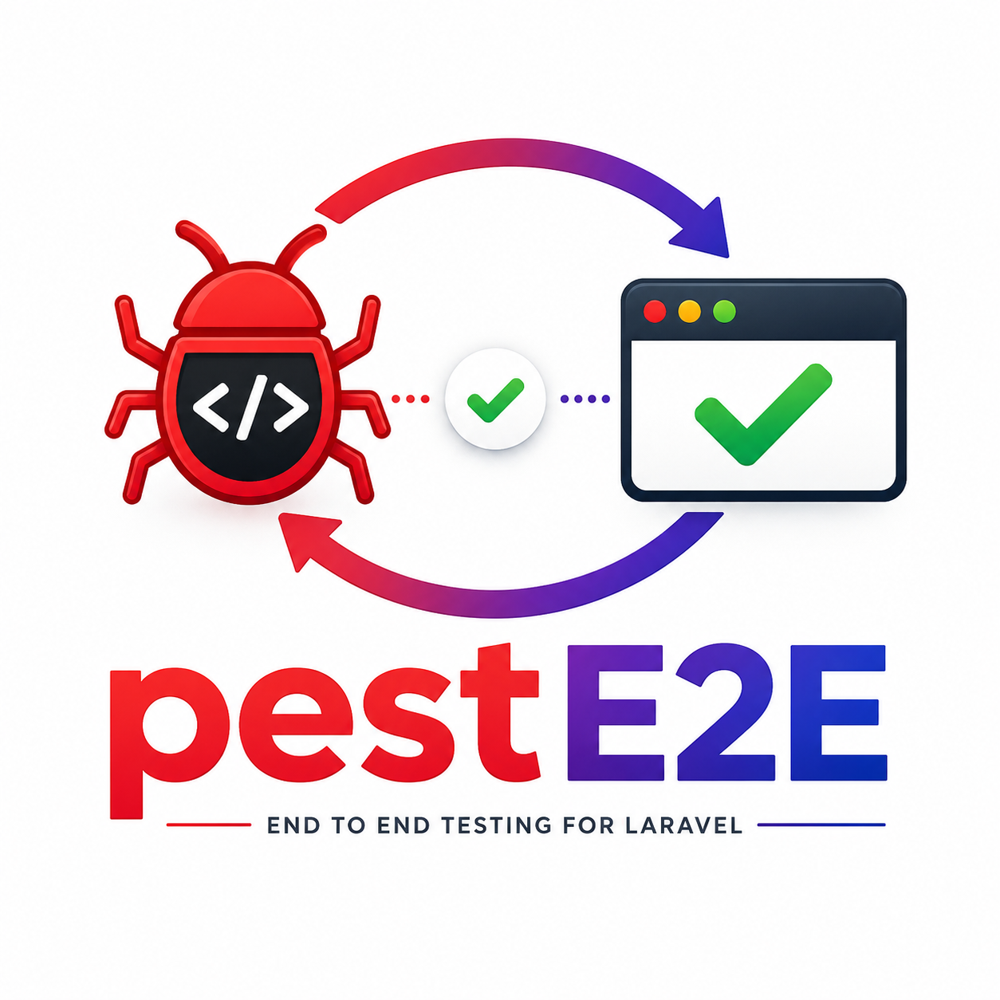
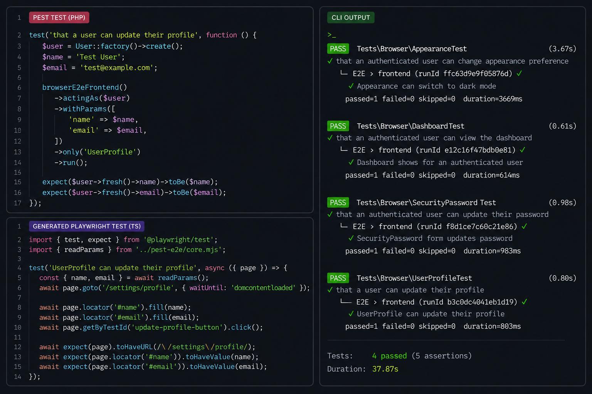

**Write Pest tests. Run real browser E2E tests. Keep everything inside your Laravel test suite.**



pestE2E is a Laravel-first bridge between Pest and JavaScript-native browser testing.

Laravel owns your test intent, state, authentication, fixtures, and assertions. JavaScript owns the browser. pestE2E connects the two and maps structured browser results back into normal Pest output.

No PHP browser DSL.
No Playwright wrapper.
No separate frontend-only testing workflow.

---

## How It Works

1. Write a Pest test in PHP.
2. Pass authentication, parameters, and context to your JavaScript test runner.
3. Run real browser tests with Playwright.
4. Report structured results back into Pest.

```text
Pest test → Playwright/browser → JSON report → Pest output
```

---

## Example

### Pest

```php
use App\Models\User;

test('that a user can update their profile', function () {
    $user = User::factory()->create();

    e2e('frontend')
        ->actingAs($user)
        ->withParams([
            'name' => 'Test User',
            'email' => 'test@example.com',
        ])
        ->runTest('UserProfile can update their profile');

    expect($user->fresh()->name)->toBe('Test User');
    expect($user->fresh()->email)->toBe('test@example.com');
});
```

### Playwright

```ts
import { test, expect } from '@playwright/test';
import { readParams } from '../pest-e2e/core.mjs';

test('UserProfile can update their profile', async ({ page }) => {
    const { name, email } = await readParams();

    await page.goto('/settings/profile');
    await page.locator('#name').fill(name);
    await page.locator('#email').fill(email);
    await page.getByTestId('update-profile-button').click();

    await expect(page.getByText('Saved.')).toBeVisible();
});
```

Laravel controls state and authentication.
JavaScript controls the browser.

---

## Why pestE2E Exists

Pest is excellent for Laravel tests. Playwright is excellent for browser tests.

pestE2E lets you use both without pretending one is the other.

It is designed for applications where the browser matters:

- Vue, React, Inertia, Livewire, or SPA interfaces
- Drag-and-drop builders
- Layout editors
- Resizable UI systems
- CSS box-model assertions
- Transform-based positioning
- DOM measurement and layout calculations
- Frontend state inspection

pestE2E does not hide Playwright behind PHP methods. It lets Laravel orchestrate your browser suite while JavaScript keeps full ownership of browser automation.

---

## Key Features

- Pest-native orchestration for JavaScript E2E tests
- Playwright by default
- Runner agnostic through worker contracts
- Laravel authentication using one-time auth tickets
- Managed Laravel testing server
- Isolated testing environment
- Parallel-safe worker ports and auth ticket keys
- JS test filtering via `only()` and `runTest()`
- Structured JSON reporting contract: `pest-e2e.v1`
- Agent / PAO JSON output for AI agents and CI parsers
- Headed and debug mode support
- Laravel Sail WSLg headed mode support
- PHPStan-compliant internals

---

## What This Is Not

pestE2E is not:

- a browser abstraction
- a PHP wrapper around Playwright
- Dusk
- Selenium
- a PHP API for `visit()`, `click()`, or `type()`

All browser logic stays in JavaScript.

---

## Status

**Stable v1**

The public PHP API, authentication contract, and JSON report schema are locked. Internal runner adapters may evolve.

---

## Installation

Install the package:

```bash
composer require valcuandrei/pest-e2e --dev
```

Then run the installer:

```bash
php artisan pest-e2e:install
```

For unattended setup:

```bash
php artisan pest-e2e:install --yes
```

Alias:

```bash
php artisan pest-e2e:install --unattended
```

The installer can:

- update your `pest.php` to include `E2ETestCase`
- publish `config/pest-e2e.php`
- publish the base E2E test case
- publish the JS harness
- publish the Playwright integration
- install `@playwright/test`
- download Playwright browser binaries with `playwright install`
- create or update `.env.testing` with parallel-safe E2E overrides
- create `database/testing.sqlite` for projects that intentionally use SQLite
- configure `phpunit.xml` so `.env.testing` controls DB/cache values
- ensure `phpunit.xml` defines a `Browser` testsuite for `tests/Browser`
- merge the WSLg headed-mode block into Laravel Sail when Sail is detected

Each step is skipped if already done.

---

## Installer Options

| Option | Description |
| --- | --- |
| `--yes` | Answer yes to all questions and perform full setup |
| `--unattended` | Alias for `--yes` |
| `--no` | Answer no to all questions |
| `--force` | Overwrite existing files when publishing |
| `--update-pest` | Update Pest config to include `E2ETestCase` |
| `--setup-env-testing` | Create `.env.testing` with parallel-safe E2E overrides |
| `--update-testing-env` | Patch an existing `.env.testing` with parallel-safe session/cache/queue settings |
| `--setup-testing-database` | Create `database/testing.sqlite` for projects that intentionally use SQLite |
| `--configure-phpunit` | Comment out DB/cache env values in `phpunit.xml` so `.env.testing` controls them |
| `--sail-wslg-headed` | Merge WSLg display/volume settings into the Sail `laravel.test` service |
| `--add-csrf-exclusion` | Add the pestE2E auth route to CSRF exclusions |
| `--publish-config` | Publish config |
| `--publish-base-test-case` | Publish `E2ETestCase` |
| `--publish-js-harness` | Publish JS harness |
| `--publish-js-playwright` | Publish Playwright adapter |
| `--publish-browser-tests` | Publish browser tests |
| `--publish-playwright-tests` | Publish Playwright tests |
| `--install-playwright` | Install `@playwright/test` and run `playwright install` |
| `--package-manager=` | Force the package manager used for E2E runs: `npm`, `yarn`, `pnpm`, or `bun` |

When publishing `E2ETestCase`, the installer resolves the package manager from tools found on your PATH in this priority order:

```text
pnpm → yarn → bun → npm
```

If multiple tools are available, interactive installs prompt you to choose. With `--yes` / `--unattended`, the installer prefers a manager matching an existing lockfile, then falls back to the priority order. If none are found on PATH, it uses lockfile-only detection, then falls back to `npm`.

Pass `--package-manager=pnpm`, `--package-manager=yarn`, `--package-manager=bun`, or `--package-manager=npm` to force the value.

---

## Testing Environment

pestE2E starts a managed Laravel server using:

```bash
--env=testing
```

If `.env.testing` exists, Laravel loads it automatically.

The installer can create this file with `--setup-env-testing` or update an existing one with `--update-testing-env`.

Recommended `.env.testing` values for Sail-compatible MySQL:

```dotenv
APP_ENV=testing
APP_URL=http://127.0.0.1

DB_CONNECTION=mysql
DB_HOST=mysql
DB_PORT=3306
DB_DATABASE=testing
DB_USERNAME=sail
DB_PASSWORD=password

SESSION_DRIVER=array
CACHE_STORE=array
QUEUE_CONNECTION=sync

PEST_E2E_AUTH_ROUTE_ENABLED=true
```

These values ensure:

- your development database is not modified
- auth routes are enabled only during testing
- the Pest process and managed server use the same database
- feature tests and browser tests do not share database-backed session/cache/queue state across workers

Your `phpunit.xml` should not override `DB_CONNECTION`, `DB_DATABASE`, `CACHE_STORE`, or `SESSION_DRIVER`. Let `.env.testing` control them.

The installer can comment those overrides out for you with:

```bash
php artisan pest-e2e:install --configure-phpunit
```

---

## Parallel Testing

Browser tests that call `e2e()->...->run()` can run with Pest / Laravel parallel testing:

```bash
php artisan test --parallel --processes=4
```

For first-time database bootstrapping, run:

```bash
php artisan test --parallel --recreate-databases
```

Use a real test database such as MySQL or PostgreSQL. Laravel parallel testing creates one database per worker:

```text
testing_test_1
testing_test_2
testing_test_3
testing_test_4
```

SQLite is not recommended for parallel browser testing because it does not provide the same per-worker database isolation model.

Each Pest worker gets:

- its own managed Laravel server
- a dedicated HTTP port
- `APP_URL` / `baseUrl` matching that port
- worker-scoped auth ticket cache keys
- the same `DB_*` / `CACHE_PREFIX` env as the PHP worker

Default port formula when `server.parallel_port_offset` is enabled:

```text
server.port + TEST_TOKEN
```

Example with base port `8800`:

```text
worker 1 → 8801
worker 4 → 8804
```

Serial runs keep using an ephemeral free port.

Configure the base port with:

```dotenv
PEST_E2E_SERVER_PORT=8800
```

Legacy env is also supported:

```dotenv
PEST_E2E_PARALLEL_BASE_PORT=8800
```

You can also configure this in `config/pest-e2e.php` under `server.port`.

---

## Quick Start

Configure a target in `tests/E2ETestCase.php` inside `setUp()`:

```php
e2e()->target('frontend', fn ($p) => $p
    ->dir('resources/js/e2e')
    ->env(['APP_URL' => 'http://localhost'])
    ->params(['baseUrl' => 'http://localhost'])
);
```

Register targets in your base E2E test case, not inside individual test functions.

Run all tests for a target:

```php
e2e('frontend')->run();
```

Run a specific JS test:

```php
e2e('frontend')->runTest('UserProfile can update their profile');
```

Pass parameters:

```php
e2e('frontend')
    ->withParams(['name' => 'Test User'])
    ->runTest('UserProfile can update their profile');
```

Authenticate as a Laravel user:

```php
e2e('frontend')
    ->actingAs($user)
    ->runTest('Dashboard loads');
```

`actingAs()` and `loginAs()` are both supported.

---

## Managed Testing Server

When you call:

```php
e2e('frontend')->run();
```

pestE2E automatically:

1. boots a temporary Laravel HTTP server
2. forces it into `APP_ENV=testing`
3. binds it to `127.0.0.1`
4. chooses a free port for serial runs, or a worker-specific port for parallel runs
5. executes your JS runner against that server
6. collects the JSON report
7. shuts the server down

No manual `php artisan serve` required.

---

## Running Tests

Local:

```bash
php artisan test
```

Laravel Sail:

```bash
sail artisan test
```

Parallel:

```bash
php artisan test --parallel --processes=4
```

Successful E2E detail output is shown in normal test runs.

In `--compact` and `--parallel` runs, passed E2E details are suppressed so Pest output stays readable. Failed E2E runs still print their details.

---

## Agent / PAO Output

For AI agents and CI parsers, enable compact JSON output. This emits one line per `e2e()->run()`:

```bash
PEST_E2E_AGENT_OUTPUT=1 php artisan test ./tests/Browser
```

You can also enable it with the CLI flag:

```bash
php artisan test ./tests/Browser --pest-e2e-agent-output
php artisan test ./tests/Browser --parallel --pest-e2e-agent-output
```

Agent output is also auto-detected when `laravel/agent-detector` is installed or common agent env vars are set, such as:

```text
CURSOR_AGENT
```

Configure it with:

```dotenv
PEST_E2E_AGENT_OUTPUT=1
PAO_FORCE=1
```

Or in `config/pest-e2e.php`:

```php
'agent_output' => true,
```

Disable it with:

```dotenv
PEST_E2E_AGENT_OUTPUT_DISABLE=1
PAO_DISABLE=1
```

In agent mode, human-readable Pest output is suppressed. Failed runs include:

- `php_test`
- `failures`
- JS test name
- JS file
- message
- stack
- `report_dir`

See `.docs/API.md` for the full JSON contract.

---

## Debug & Headed Mode

```bash
php artisan test --browse
php artisan test --debug
php artisan test --run-using=yarn
```

- `--browse` / `--headed` runs the browser in headed mode
- `--debug` enables debug mode and implies headed mode
- `--run-using=npm|yarn|pnpm|bun` uses a specific package manager for E2E runs

The default package manager is set in `E2ETestCase::$e2ePackageManager` during install.

---

## Timing Instrumentation

Enable baseline timing markers:

```dotenv
PEST_E2E_TIMING=true
```

Markers are emitted to `stderr` with this prefix:

```text
[pest-e2e:timing]
```

Each marker is a JSON payload with:

- `phase`
- `atMs`
- optional `durationMs`

---

## Headed Mode in Sail

If you run Pest inside Laravel Sail on Windows WSL2 and want headed browser mode, forward WSLg into the container by adding this to your `laravel.test` service:

```yaml
environment:
  DISPLAY: ${DISPLAY}
  WAYLAND_DISPLAY: ${WAYLAND_DISPLAY}
  XDG_RUNTIME_DIR: ${XDG_RUNTIME_DIR}
  PULSE_SERVER: ${PULSE_SERVER}

volumes:
  - /mnt/wslg:/mnt/wslg
  - /tmp/.X11-unix:/tmp/.X11-unix
```

This is only required for headed browser mode inside Docker on WSL2. Headless mode works without additional configuration.

---

## Authentication Contract

Default auth route:

```text
/pest-e2e/auth/login
```

Configure it with:

```php
config('pest-e2e.auth.route');
```

Security:

- disabled by default
- only enabled when `PEST_E2E_AUTH_ROUTE_ENABLED=true`
- requires a header, default: `X-Pest-E2E: 1`
- tickets are single-use
- tickets are short-lived

---

## Reports & Artifacts

Playwright emits its JSON report to stdout. The PHP side parses it in memory and maps it to the canonical `pest-e2e.v1` schema.

Playwright artifacts are written to a run-scoped directory:

```text
{reports.base_dir}/{target}/{runId}
```

The default base directory is:

```text
storage/framework/testing/pest-e2e
```

Configure it with:

```php
config('pest-e2e.reports.base_dir');
```

Old run directories are pruned according to `reports.prune`. Only directories marked as pestE2E runs are deleted, and the current run directory is never pruned.

---

## Configuration

Key config keys in `config/pest-e2e.php`:

| Key | Description |
| --- | --- |
| `auth.route` | Auth endpoint path. Default: `/pest-e2e/auth/login` |
| `auth.route_enabled` | Enable auth route. Default: `false`, set via `PEST_E2E_AUTH_ROUTE_ENABLED` |
| `auth.ttl_seconds` | Auth ticket TTL. Default: `60` |
| `auth.header.name` / `auth.header.value` | Header required for auth requests. Default: `X-Pest-E2E: 1` |
| `server.driver` | Server runner: `artisan` or `php_builtin`. Default: `php_builtin` |
| `server.host` | Bind address for the managed server. Default: `127.0.0.1` |
| `server.port` | Base HTTP port for parallel workers. Default: `8800` |
| `server.parallel_port_offset` | Parallel workers use `server.port + TEST_TOKEN`. Default: `true` |
| `reports.base_dir` | Base directory for Playwright artifacts. Default: `storage/framework/testing/pest-e2e` |
| `reports.prune.enabled` | Enable old run pruning. Default: `true` |
| `reports.prune.keep_runs` | Number of most recent marked runs to keep. Default: `50` |
| `reports.prune.keep_days` | Age window for marked runs to keep. Default: `7` |
| `timing.enabled` | Enable timing instrumentation. Default: `false`, set via `PEST_E2E_TIMING` |
| `js_runner.driver` | JS runner. Default: `playwright` |
| `js_runner.mode` | Runner mode: `cold` or `warm`. Default: `cold` |
| `package_manager` | Package manager for E2E runs: `npm`, `yarn`, `pnpm`, or `bun` |
| `parallel.base_port` | Deprecated alias for `server.port` |
| `agent_output` | Force agent JSON output. Default: from `PEST_E2E_AGENT_OUTPUT` / `PAO_FORCE` |
| `bindings` | Contract-to-implementation map for swapping the JS runner |

---

## Runner Swapping

pestE2E uses contracts for the JavaScript worker and JSON parser.

The default bindings use Playwright, but you can override them in `config/pest-e2e.php` to integrate another runner, such as Cypress or Puppeteer.

The important boundary stays the same:

```text
Laravel/Pest owns orchestration.
JavaScript owns browser execution.
JSON owns the report contract.
```

---

## Final Positioning

pestE2E is not “browser testing for Laravel.”

It is a contract-driven bridge between Laravel and JavaScript-native E2E systems.

If you are building advanced frontend applications and want Laravel to orchestrate while JavaScript owns the browser, this package is for you.
